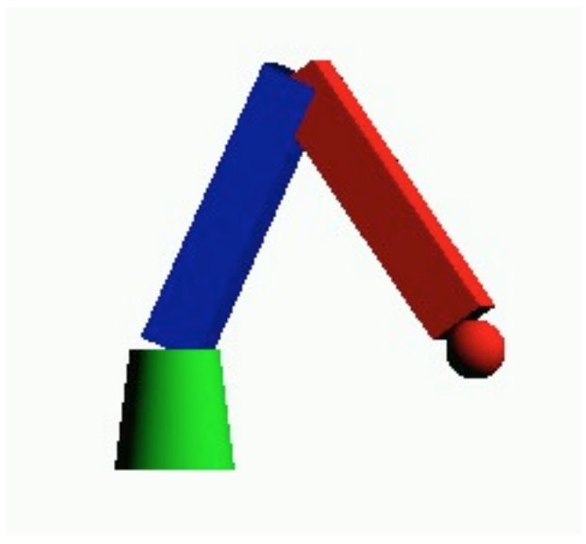

# OpenGl_roboticArm

A program called myrobot which displays a robotic arm which the user control to pick up and move an object. The robot is composed of three parts: the base, a lower arm, and an upper arm. There are two views, a side view which allows you to view the robot from the side and a top view which is from the top. 

To run the program use:

`./myrobot old_x old_y old_z new_x new_y new_z <-tv | -sv>`

Here old_x, old_y and old_z are the original coordinates and new_x, new_y and new_z are the new coordinates. The last argument tells whether “top” (-tv) or “side view” (-sv) is used.
